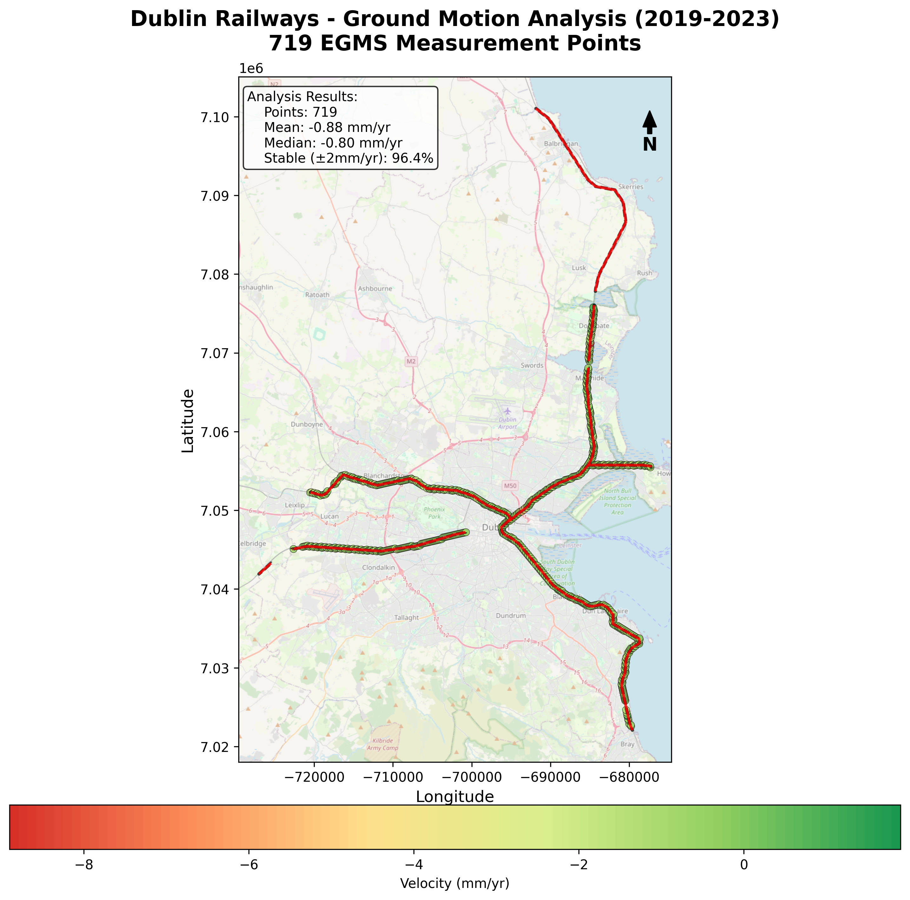
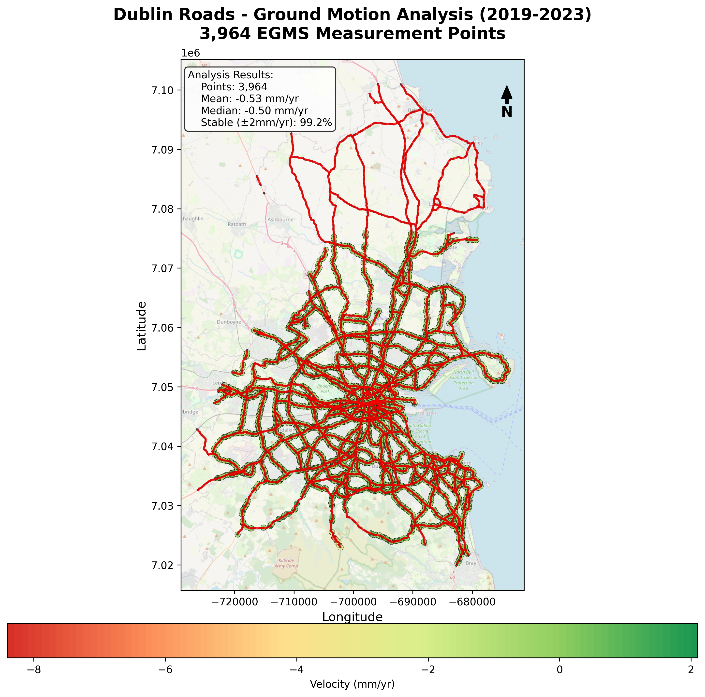

# Dublin Infrastructure Ground Motion Analysis

**InSAR-based monitoring of critical infrastructure using EGMS satellite data (2019-2023)**

[](https://www.python.org/)
[](https://geopandas.org/)
[](https://opensource.org/licenses/MIT)

## 📋 Project Overview

This project analyzes ground motion patterns around Dublin's critical infrastructure using satellite-based Interferometric Synthetic Aperture Radar (InSAR) data from the European Ground Motion Service (EGMS). The analysis evaluates stability of railways, roads, and Dublin Port using 46,075 measurement points collected between 2019-2023.

### Key Features
- ✅ Spatial analysis of infrastructure buffer zones
- ✅ Statistical assessment of ground velocity patterns
- ✅ Automated map generation using Python
- ✅ Risk classification and reporting
- ✅ Reproducible workflow with step-by-step scripts

---

## 🎯 Objectives

1. Assess ground stability around Dublin's critical infrastructure
2. Identify areas of subsidence or uplift affecting transport networks
3. Quantify movement rates and classify risk levels
4. Provide actionable insights for infrastructure monitoring

---

## 📊 Key Findings

### Infrastructure Stability Summary

| Infrastructure | Points Analyzed | Mean Velocity (mm/yr) | Stability (%) | Risk Level |
|---------------|----------------|----------------------|---------------|------------|
| **Roads** | 3,964 | -0.53 | 99.17% | ✅ LOW |
| **Railways** | 719 | -0.88 | 96.38% | ✅ LOW |
| **Dublin Port** | 128 | -0.93 | 95.31% | ✅ LOW |
| *Dublin Baseline* | 46,075 | -0.67 | 94.62% | - |

**Key Observations:**
- ✅ **Roads show exceptional stability** - 99.17% of points within ±2 mm/yr threshold
- ✅ **All infrastructure assessed as LOW RISK** - no immediate action required
- ✅ **Roads perform better than Dublin baseline** - 0.14 mm/yr less subsidence
- ⚠️ Harbour shows slightly higher subsidence (expected on reclaimed land)

---

## 🗺️ Analysis Results

### Map 1: Railway Corridor Analysis
*719 measurement points along Dublin's railway network*



### Map 2: Road Network Analysis
*3,964 measurement points across Dublin's road infrastructure*



### Map 3: Dublin Port Analysis
*128 measurement points within port boundaries*


---

## 🛠️ Methodology

### 1. Data Acquisition
- **EGMS Data**: European Ground Motion Service L3 products (2019-2023)
- **Infrastructure Data**: Official datasets from Irish government sources
  - Railways: Ordnance Survey Ireland (OSi)
  - Roads: Road Management Office
  - Harbour: Marine Institute Ireland

### 2. Spatial Analysis Workflow

```
Raw Data (EGMS + Infrastructure)
         ↓
Geographic Clipping (Dublin area)
         ↓
Buffer Zone Creation (50m railways, 30m roads)
         ↓
Spatial Join (find points within buffers)
         ↓
Statistical Analysis
         ↓
Visualization & Reporting
```

### 3. Buffer Zones
- **Railways**: 50m corridor (safety buffer)
- **Roads**: 30m corridor (road shoulder width)
- **Harbour**: Boundary-based (no additional buffer)

### 4. Risk Classification
- **Stable**: ±0-2 mm/yr
- **Low Risk**: ±2-5 mm/yr
- **Medium Risk**: ±5-10 mm/yr
- **High Risk**: >±10 mm/yr

---

## 📂 Project Structure

```
dublin-infrastructure-ground-motion/
├── README.md                       # This file
├── scripts/
│   ├── step1_create_buffers.py    # Create buffer zones around infrastructure
│   ├── step2_find_points_in_buffers.py  # Spatial join analysis
│   ├── step3_calculate_statistics.py    # Statistical analysis
│   └── create_maps.py             # Automated map generation
├── results/
│   ├── maps/                      # Output maps (PNG, 300 DPI)
│   └── statistics/                # Summary tables (CSV)
├── data/
│   └── sample_data/               # Example data structure
└── docs/
    └── METHODOLOGY.md             # Detailed methodology
```

---

## 🚀 Quick Start

### Prerequisites

```bash
# Python 3.8+
# Required packages
pip install geopandas pandas numpy matplotlib contextily
```

### Installation

```bash
# Clone repository
git clone https://github.com/BazenHaile/dublin-infrastructure-ground-motion.git
cd dublin-infrastructure-ground-motion

# Install dependencies
pip install -r requirements.txt
```

### Usage

```bash
# Step 1: Create infrastructure buffers
python scripts/step1_create_buffers.py

# Step 2: Perform spatial analysis
python scripts/step2_find_points_in_buffers.py

# Step 3: Calculate statistics
python scripts/step3_calculate_statistics.py

# Step 4: Generate maps
python scripts/create_maps.py
```

---

## 📈 Technical Details

### Coordinate Systems
- **Input EGMS**: EPSG:3035 (ETRS89-extended / LAEA Europe)
- **Analysis**: EPSG:2157 (Irish Transverse Mercator) - for accurate meter-based buffers
- **Visualization**: EPSG:3857 (Web Mercator) - for basemap compatibility

### Data Processing
- **Python Libraries**: GeoPandas, Pandas, NumPy, Matplotlib
- **GIS Software**: QGIS 3.x (for data validation and visualization)
- **Basemaps**: OpenStreetMap via Contextily

### Performance
- Processing time: ~30 seconds for complete analysis
- Memory usage: <2GB RAM
- Output resolution: 300 DPI (publication quality)

---

## 📊 Results & Deliverables

### Statistics Files
- `infrastructure_summary.csv` - Complete statistics for all infrastructure
- `infrastructure_comparison.csv` - Comparison with Dublin baseline
- `infrastructure_risk_assessment.csv` - Risk levels and recommendations

### Maps (300 DPI)
- `map_01_railways_analysis.png` - Railway corridor analysis
- `map_02_roads_analysis.png` - Road network analysis
- `map_03_harbour_analysis.png` - Dublin Port analysis

---

## 🎓 Academic Context

**Project Type**: MSc Remote Sensing Portfolio Project  
**Institution**: University College Dublin  
**Program**: SAR/InSAR Remote Sensing  
**Duration**: December 2024  
**Author**: Bazen Haile

---

## 📚 Data Sources

- **EGMS**: [European Ground Motion Service](https://egms.land.copernicus.eu/)
- **Irish Infrastructure**: [Data.gov.ie](https://data.gov.ie/)
- **OSi Mapping**: [Ordnance Survey Ireland](https://www.osi.ie/)
- **Basemaps**: OpenStreetMap contributors

---

## 🔬 Future Work

- [ ] Time-series analysis of seasonal variations
- [ ] Integration with weather/climate data
- [ ] Automated monitoring dashboard
- [ ] Machine learning for subsidence prediction
- [ ] Expansion to other Irish cities

---

## 📝 License

This project is licensed under the MIT License - see the [LICENSE](LICENSE) file for details.

---

## 🤝 Contributing

Contributions, issues, and feature requests are welcome! Feel free to check the [issues page](https://github.com/BazenHaile/dublin-infrastructure-ground-motion/issues).

---
## 📧 Contact

 **Bazen Haile**
- GitHub: [@BazenHaile](https://github.com/BazenHaile)
- LinkedIn: [Bazen Hilemelekot Amene](https://www.linkedin.com/in/bazenhilemelekotamene0877882085/)
- Email: bazenhaileam@gmail.com
---

## 🙏 Acknowledgments

- European Ground Motion Service (EGMS) for satellite data
- Irish Government Open Data Portal
- University College Dublin
- OpenStreetMap contributors

---

## 📖 Citation

If you use this work, please cite:

```
Haile, B. (2024). Dublin Infrastructure Ground Motion Analysis: 
InSAR-based monitoring using EGMS satellite data (2019-2023). 
GitHub repository: https://github.com/BazenHaile/dublin-infrastructure-ground-motion
```

---

**⭐ If you find this project useful, please consider giving it a star!**
